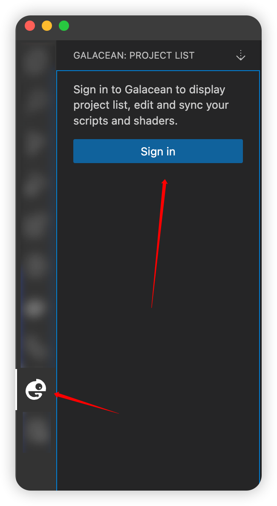
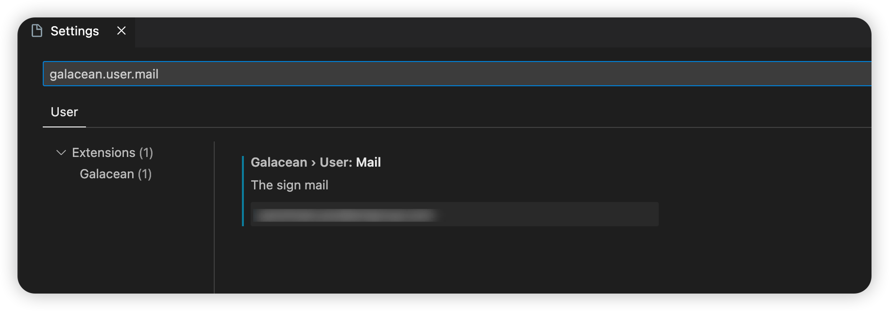
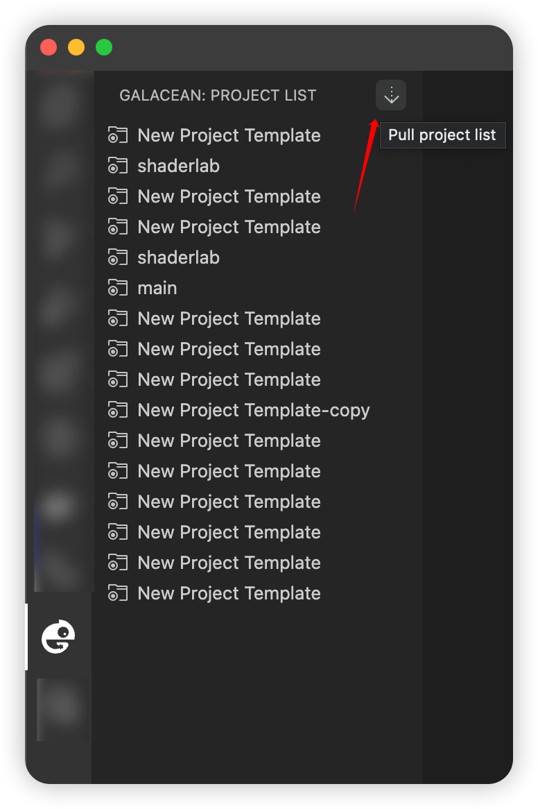
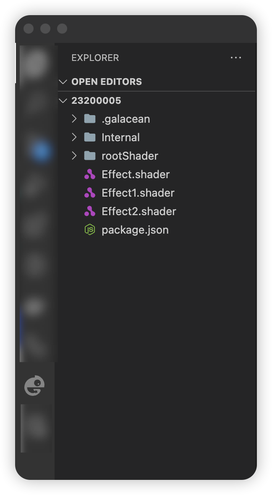
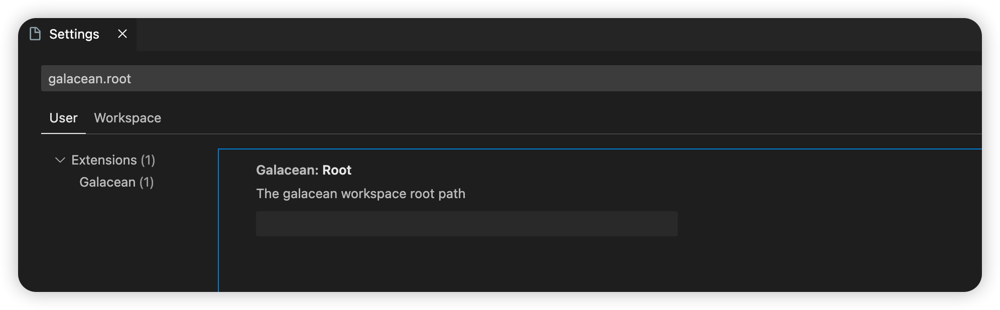
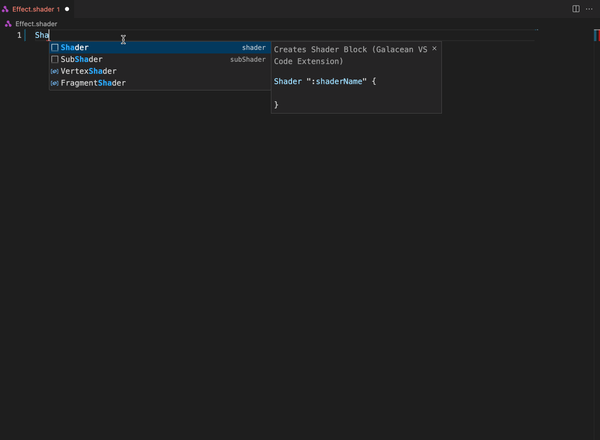
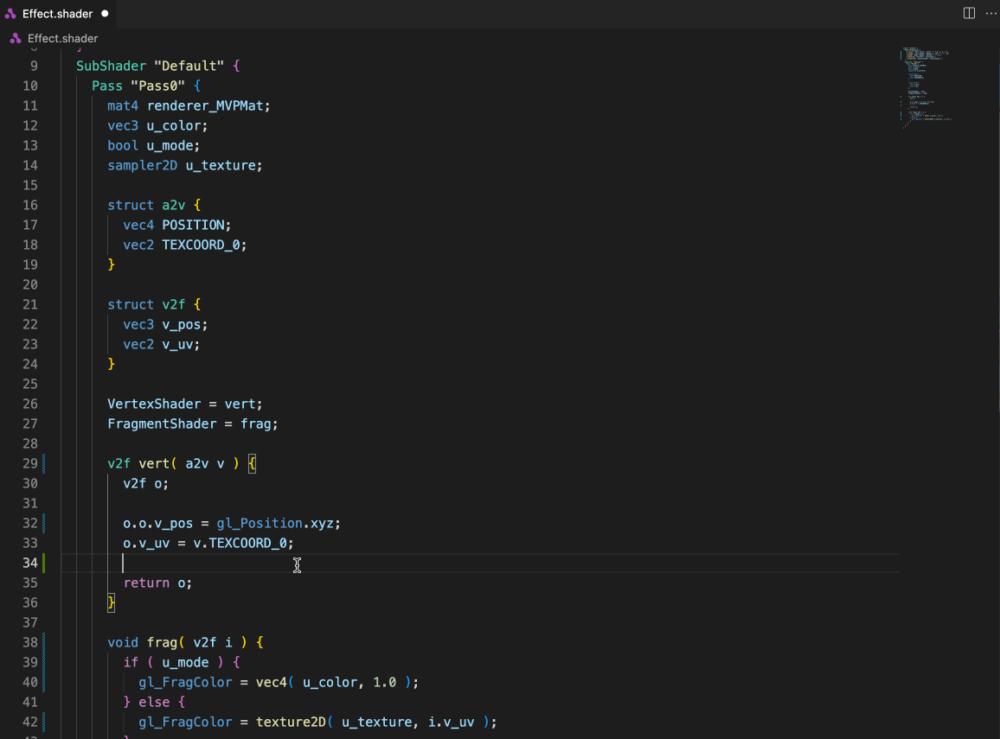
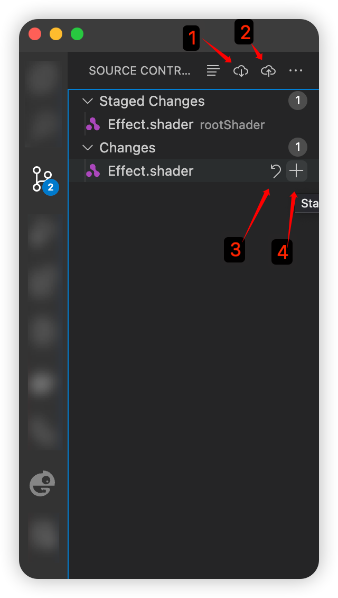

## 首次登录

1. 点击 Activity Bar 里的 Galacean Icon 进入项目列表 View
2. 点击登录按钮
3. 按照提示输入 Galacean 账户邮箱以及登录验证码

> [!TIP]
>
> 可以通过`Command + ','`搜索`galacean.user.mail`设置默认登录邮箱，免去每次登录前输入登录邮箱操作

   <figure style="flex:1;">
     
    <figcaption style="text-align:center; color: #889096;">登录</figcaption>
  </figure>
  <figure style="flex:3;">
    
    <figcaption style="text-align:center; color: #889096;font-size:12px">默认邮箱设置</figcaption>
  </figure>

## 项目列表

首次登录成功后插件会自动同步用户 Galacean 项目至项目列表 View，后续在 Galacean Editor 中创建的新项目可以通过点击图中同步按钮进行主动更新同步

<figure align="center">
	
	<figcaption style="color: #889096;">Project List View</figcaption>
</figure>

## 同步项目资产

在项目列表 View 中选中点击任一 Galacean 项目，首次点击插件会自动同步该项目所有`Script`、`Shader`资产至本地磁盘并导航至 Explorer，打开该项目的工作空间

> [!TIP]
>
> 可以通过`Command + ','`搜索`galacean.root`设置 Galacean 项目本地工作空间根路径，默认的路径为 `~/galacean`

   <figure style="flex:1;">
     
    <figcaption style="text-align:center; color: #889096;">登录</figcaption>
  </figure>
  <figure style="flex:3;">
    
    <figcaption style="text-align:center; color: #889096;font-size:12px">默认邮箱设置</figcaption>
  </figure>

## 资产文件编辑

打开同步至本地磁盘的项目空间后可以直接打开 VSCode terminal，使用包管理工具安装 Script 资产相关依赖，然后使用 VSCode 对资产进行编辑。

#### Shader 资产编辑

插件对使用 shaderlab 语法编写的 Shader 资产提供了相关的语言支持，目前包含：

| Feature                | 完善度(满分 5★) |
| ---------------------- | --------------- |
| Completion 自动补全    | ★★★★            |
| Signature 函数签名提示 | ★               |
| Hover Hover 提示       | ★★★             |
| Highlight 语法高亮     | ★★★             |
| Formatting 代码格式化  | ★★★             |
| Snippets 代码段填充    | ★★              |

   <figure style="flex:1;">
     
    <figcaption style="text-align:center; color: #889096;">Snippet</figcaption>
  </figure>
  <figure style="flex:1;">
     
    <figcaption style="text-align:center; color: #889096;">Completion</figcaption>
  </figure>

#### [TODO] Script 资产编辑

- [ ] 引入 js 生态三方库

  本地可以通过任意包管理工具(如 npm)在项目工作空间安装三方库，然后通过 Source Control 同步至云端。

## Source Control 源码版本控制

<figure align="center">
    
  <figcaption style="text-align:center; color: #889096;">Source Control</figcaption>
</figure>

本地编辑项目资产后在 `SourceControl View` 中可以看到本地资产文件和云端资产文件的 diff 内容。如截图所示，用户可以通过途中按键进行相关操作：

1. 文件资产内容下行同步更新
2. 将本地`Staged Changes`变更上行同步至云端
3. 撤销还原本地文件变更内容
4. 将本地文件变更内容添加至`Staged Changes`

## Notes

1. 考虑到资产创建需要上传资产 meta 相关数据，所以 VSCode 插件暂时没有做资产新增同步到云端功能
